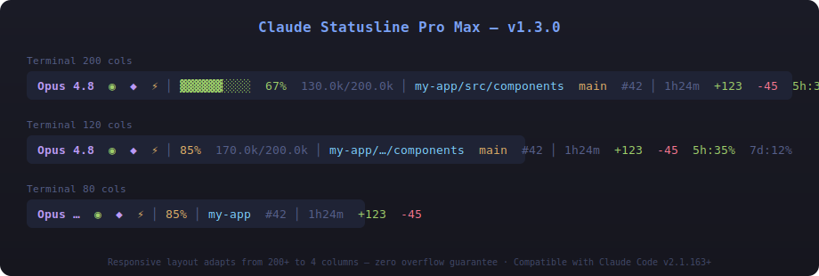

# Claude Statusline Pro Max

[English Documentation](README.md)

[Claude Code](https://claude.ai/code) CLI 的响应式信息密集状态栏。纯 bash 脚本 — 除 `jq` 外零依赖。



## 特性

- **4 区域布局**：Model | Context | Workspace | Duration — 自适应任意终端宽度
- **TIER 信号质量**：上下文显示精度随可用数据自动调整
- **家族保留模型名**：`opus-4-7`、`3-5-sonnet`、`haiku-4-5` — 永不丢失身份
- **CJK & emoji 安全**：每一级截断都基于显示宽度，包括紧急回退
- **零溢出保证**：15 级响应式 + 回退，4–200 列全测试
- **~44ms/次刷新**：零 fork 响应式循环 + 预(计算区域长度)

## 快速开始

```bash
# 安装
!cp statusline-command.sh ~/.claude/statusline-command.sh

# 在 ~/.claude/settings.json 中添加
{
 <parameter name="statusLine": {
    "type": "command",
    "command": "bash ~/.claude/statusline-command.sh",
    "refreshInterval": 5
  }
}
```

## 4 个区域

```
Opus 4.7 ● h │ ▓▓▓▓▓▓▓░░░ 67.3% 80.0k/50.0k │ my-app/src/components  main │ 1h24m 130.0k 5h:35% 7d:12%
└──── 模型 ────┘ └──────── 上下文 ─────────────┘ └──── 工作区 ──────┘ └──── 时长 ────┘
```

| 区域 | 内容 | 颜色逻辑 |
|------|------|----------|
| **模型** | 名称 + 思考/努力/代理标记 | Opus=品红, Sonnet=蓝, Haiku=青 |
| **上下文** | 进度条 + % + token 数量 | 绿色 <70%, 黄色 70-86%, 红色 >86% |
| **工作区** | 项目 + 相对路径 + git 分支 + vim 模式 | — |
| **时长** | 经过时间 + 会话 token + 速率限制 | 速率：绿色 ≤59%, 黄色 60-84%, 红色 ≥85% |

## 上下文 TIER 系统

上下文区域根据信号质量自适应 — 永不显示误导性数据：

| TIER | 信号 | 显示 |
|------|------|------|
| 1 | 完整 token 分解可用 | 条 + % + input/output/cache token |
| 2 | 百分比已知，无 token 分解 | 条 + % + 上下文大小 |
| 3 | 仅上下文大小已知 | "ctx 200.0k" |
| 0 | 无上下文数据 | "n/a" |

## 响应式行为

窄终端下内容渐进截断：

1. 速率限制最先移除
2. 然后 vim 模式、会话 token、时长
3. 路径缩短（完整 → 中等 → 短）
4. 上下文简化（完整 → 中等 → 短）
5. 模型名缩短（完整 → 中等 → 短/家族名）
6. 紧急：仅显示模型家族关键词

## 标记

| 标记 | 含义 |
|------|------|
| ● | 思考已启用 |
| ● | 代理活跃 |
| h | 努力：high |
| x | 努力：xhigh |
| M | 努力：max |
| [N] | Vim：NORMAL |
| [I] | Vim：INSERT |
| [V] | Vim：VISUAL |

## 配置

所有配置通过 `~/.claude/settings.json`：

```json
{
  "statusLine": {
    "type": "command",
    "command": "bash ~/.claude/statusline-command.sh",
    "refreshInterval": 5
  }
}
```

`refreshInterval` 控制状态栏更新频率（秒）。推荐：3–5。

## 文档

- [架构](docs/zh/ARCHITECTURE.md) — 内部设计和数据流
- [自定义](docs/zh/CUSTOMIZATION.md) — 主题和视觉调整
- [兼容性](docs/zh/COMPATIBILITY.md) — 平台和终端支持
- [更新日志](docs/zh/CHANGELOG.md) — 版本历史

## 依赖

- Bash 3.2+（macOS 默认）
- `jq`（JSON 解析）
- 标准 Unix 工具（`git`、`stat`、`sed`、`grep`）

## 许可证

MIT
